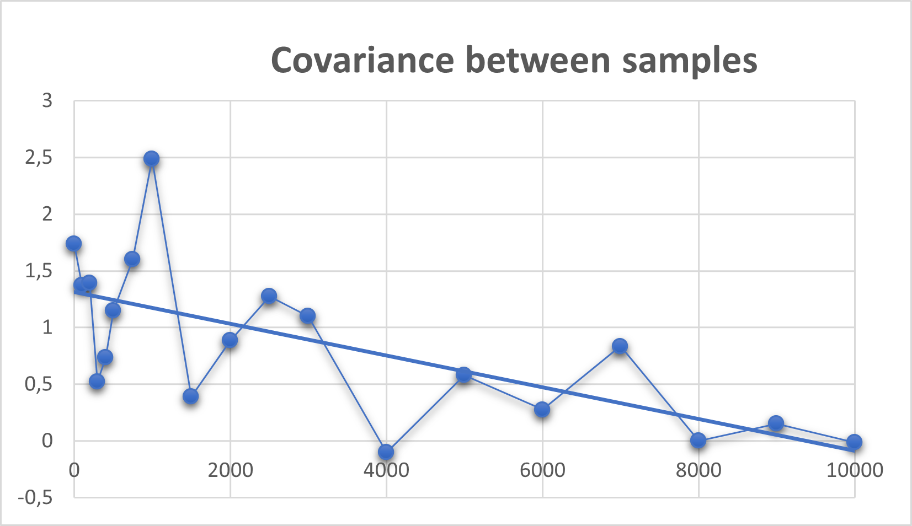

# Assignment 4

## Serial correlation:

To analyze serial correlation between the samples, scenario with following parameters was used:  
- Patient generation was based on exponential distribution and mean of 25 time units.
- Number of prepration units was 3.
- Number of operatoin units was 1.
- Number of recovery units was 4.
- Preparation time was based on exponential distribution with mean of 40 time units.
- Operation time was based on exponential distribution with mean of 20 time units.
- Recovery time was based on uniform distribution between 40 and 50 time units.

For sampling interval, following values where used to analyze correlation (time units):  
- 0, 100, 200, 300, 400, 500, 750, 1000, 1500, 2000, 2500, 3000, 4000, 5000, 6000, 7000, 8000, 9000, 10000 

Length of a invidual sample was 1000 time units.  

Results for correlation are in **pairwise_comparison** excel sheet.

**Note: 20 samples were taken for each simulation run, also Unif(40,50) was used for recovery units.**
