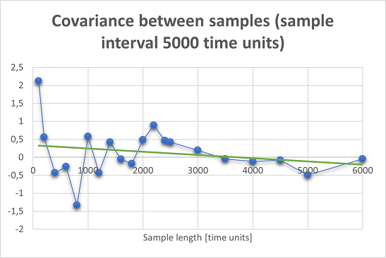

# Assignment 4

## Serial correlation

To analyze serial correlation between the samples, scenario with following parameters was used:  
- Patient generation was based on exponential distribution and mean of 25 time units.
- Number of prepration units was 3.
- Number of operatoin units was 1.
- Number of recovery units was 4.
- Preparation time was based on exponential distribution with mean of 40 time units.
- Operation time was based on exponential distribution with mean of 20 time units.
- Recovery time was based on uniform distribution between 40 and 50 time units.

Correlation analysis was divided into two experiments:
- Experiment with fixed sample length and different sampling intervals:
  - Length of a invidual sample was 1000 time units.
  - Sampling intervals: 0, 100, 200, 300, 400, 500, 750, 1000, 1500, 2000, 2500, 3000, 4000, 5000, 6000, 7000, 8000, 9000, 10000 time units.
- Experiment with fixed sampling interval and different sample lengths:
  - Sampling interval was 5000.
  - Length of a invidual sample: 100, 200, 400, 600, 800, 1000, 1200, 1400, 1600, 1800, 2000, 2200, 2400, 2500 time units. 

### Results
Chart showing correlation presented below is from [covariances](covariances.xlsx) excel sheet, where full calculations can be found. 

Chart showing correlation presented below is from [covariances_length](covariances-length.xlsx) excel sheet, where full calculations can be found. 

The results show that with higher interval (>= 8000 time units) between invidual samples, correlation between the samples is negligible. In addition to interval between the samples, sample length affects the correlation as smaller sample lengths shows higher correlation between the samples.

**Note: 20 samples were taken for each simulation run, also Unif(40,50) was used for recovery units.**

## Regression model

Based on correlation analysis, sampling interval 10000 was used.
